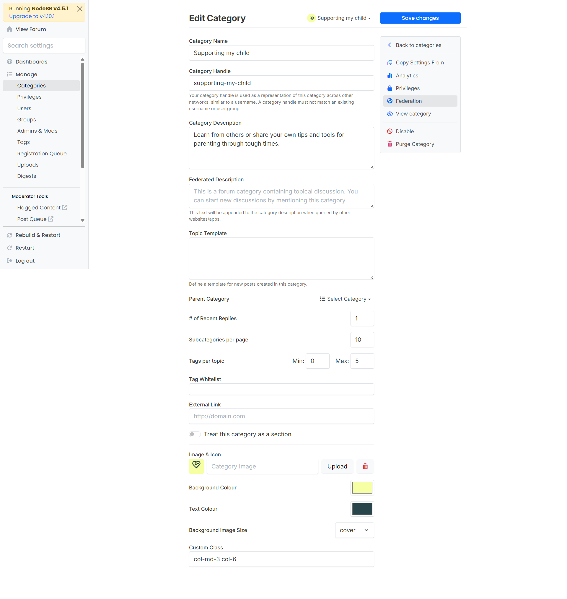
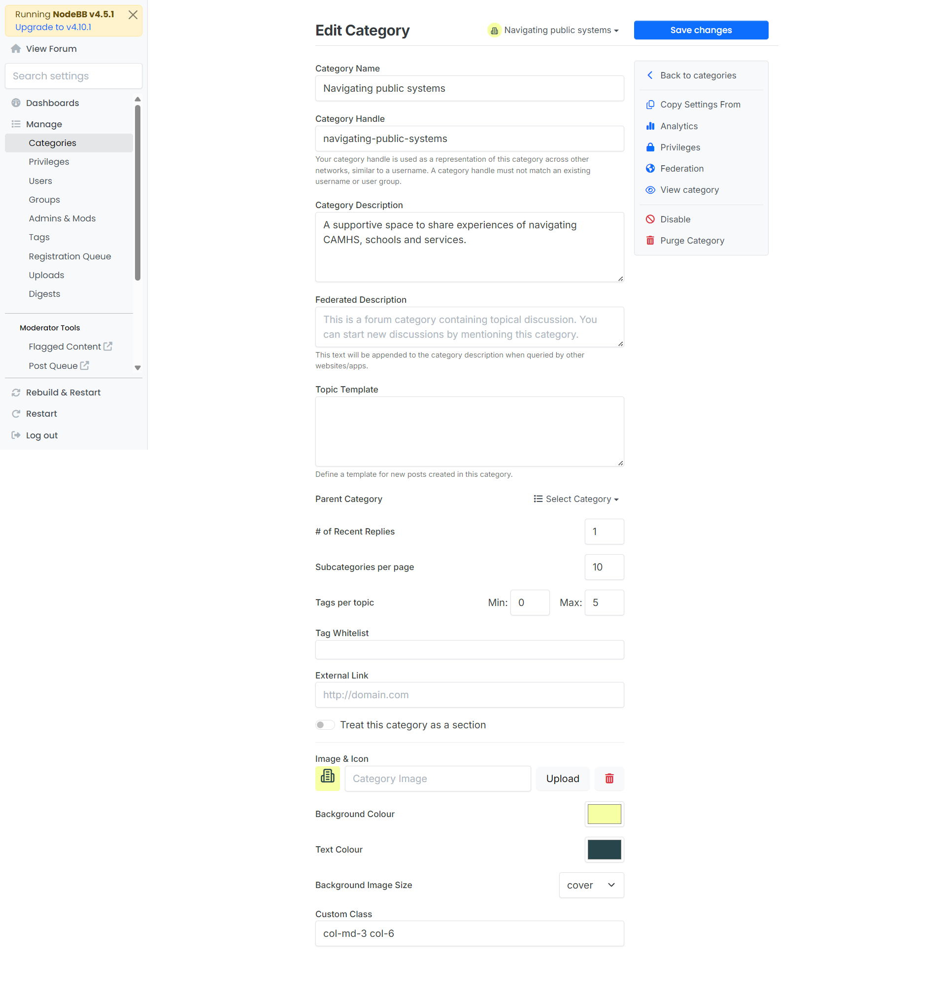
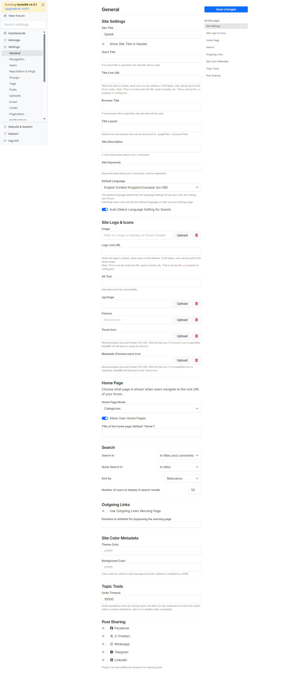
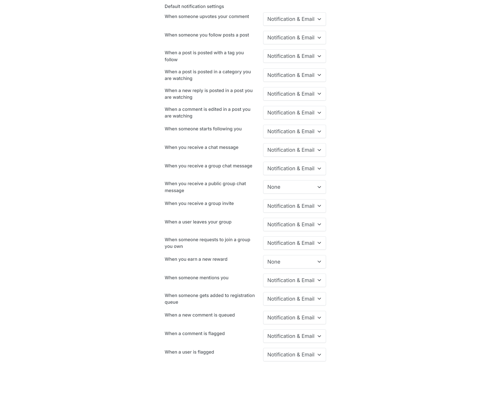
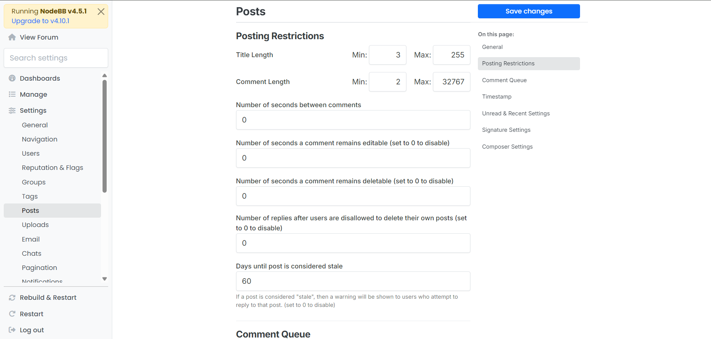
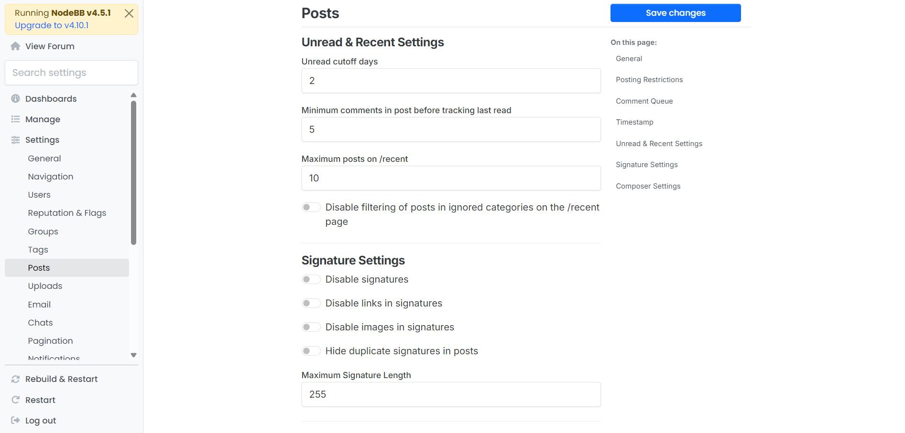
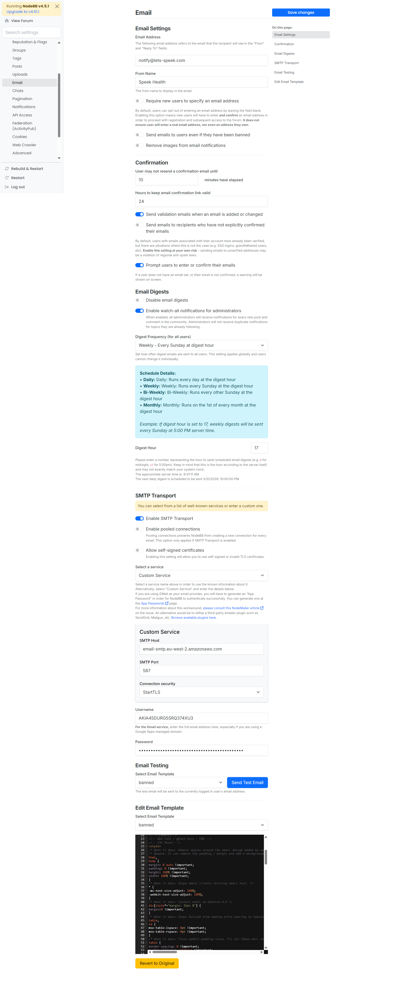
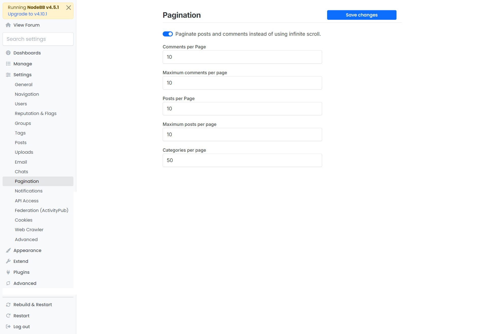

# Admin Control Panel (ACP) — Essential Settings

This guide documents the **minimum ACP settings** we consider essential for a healthy Speek ↔ NodeBB environment.

All settings in this document are mandatory and must be configured in every environment.

---

## Access

- **Admin URL**:
  - Local: `http://localhost:4567/admin`
  - Dev: `https://dev-community.lets-speek.com/admin`
  - Staging: `https://test-community.lets-speek.com/admin`
  - Production: `https://community.lets-speek.com/admin`

---

## 1) Manage > Categories

**ACP → Manage → Categories**

### Mandatory

- Ensure categories match the Speek community structure (no accidental default/test categories in staging/production).

### Current categories

- `Introductions`
- `Supporting my child`
- `Navigating public systems`
- `Looking after myself`

### Category edit screenshots

### Mandatory checks per category

- Correct **Category Name**
- Correct **Category Handle**
- Correct **Category Description**
- Correct **Icon**
- Correct **Background Color**
- Correct ordering in the list

---

## 2) Settings > General

**ACP → Settings → General**

### Required

- Confirm **Site Title / Site Description** and branding are correct per environment.
- Confirm **Site Title in Header** is disabled.
- Confirm **Site URL** matches the deployed environment domain.

---

## 3) Settings > Users > Default notifications settings

**ACP → Settings → Users → Default notifications settings**

### Recommended

- Review defaults for new users so they’re not overly noisy (or overly silent) for your community.
- If you rely on email notifications, ensure defaults make sense alongside your email configuration.
- Configure the following values in **Default notification settings**:
  - **Notification & Email**:
    - When someone upvotes your comment
    - When someone you follow posts a post
    - When a post is posted with a tag you follow
    - When a post is posted in a category you are watching
    - When a new reply is posted in a post you are watching
    - When a comment is edited in a post you are watching
    - When someone starts following you
    - When you receive a chat message
    - When you receive a group chat message
    - When you receive a group invite
    - When a user leaves your group
    - When someone requests to join a group you own
    - When someone mentions you
    - When someone gets added to registration queue
    - When a new comment is queued
    - When a comment is flagged
    - When a user is flagged
  - **None**:
    - When you receive a public group chat message
    - When you earn a new reward

---

## 4) Settings > Posts > Post Restrictions

**ACP → Settings → Posts → Post Restrictions**

### Mandatory (especially in production)

- Set reasonable anti-abuse limits (rate limits, minimum intervals, etc.) appropriate for your traffic profile.
- Review any restrictions that could break legitimate usage (e.g., too strict limits impacting normal replies).
- Configure the following values in **Posting Restrictions**:
  - **Title Length**: Min `3`, Max `255`
  - **Comment Length**: Min `2`, Max `32767`
  - **Number of seconds between comments**: `0`
  - **Seconds a comment remains editable** (set to `0` to disable): `0`
  - **Seconds a comment remains deletable** (set to `0` to disable): `0`
  - **# of replies after which users are disallowed to delete their own posts** (set to `0` to disable): `0`
  - **Days until post is considered stale**: `60`

---

## 5) Settings > Posts > Unread & Recent Settings

**ACP → Settings → Posts → Unread & Recent Settings**

### Mandatory

- Tune “unread” and “recent” behavior to match how you want activity to surface for members.
- Configure the following values:
  - **Unread cutoff days**: `2`
  - **Minimum comments in post before tracking last read**: `5`
  - **Maximum posts on /recent**: `10`
  - **Disable filtering of posts in ignored categories on the /recent page**: `OFF`
  - **Signature Settings**:
    - Disable signatures: `OFF`
    - Disable links in signatures: `OFF`
    - Disable images in signatures: `OFF`
    - Hide duplicate signatures in posts: `OFF`
    - **Maximum Signature Length**: `255`

---

## 6) Settings > Email

**ACP → Settings → Email**

### Mandatory

Configure outbound email so operational workflows don’t silently fail. After changes, click **Save changes** and use **Send Test Email** where available.

- **Email Settings**
  - **Email Address**: `notify@lets-speek.com`
  - **From Name**: `Speek Health`
  - **Options** (as configured): require new users to specify an email address **ON**; send emails to banned users and remove images from notifications per your policy

- **Confirmation**
  - **Minutes before user can resend confirmation email**: `10`
  - **Hours to keep confirmation link valid**: `24`
  - **Send validation emails when an email is added or changed**: **ON**
  - **Send emails to recipients who have not explicitly confirmed**: **OFF**
  - **Prompt users to enter or confirm their email**: **ON**

- **Email Digests**
  - **Disable email digests** / **Enable watch-all notifications for administrators**: per your policy (screenshot: watch-all **ON**)
  - **Digest frequency**: `Weekly`
  - **Digest hour**: `17`

- **SMTP Transport**
  - **Enable SMTP Transport**: **ON**
  - **Enable pooled connections** / **Allow self-signed certificates**: per your policy (typically **OFF** for SES)
  - **Service**: `Custom Service`
  - **SMTP Host**: `email-smtp.eu-west-2.amazonaws.com`
  - **SMTP Port**: `587`
  - **Connection security**: `StartTLS`
  - **Username / Password**: from your mail provider (e.g. SES SMTP credentials); never commit secrets to the repo

- **Email Testing**
  - Pick a template (e.g. `banned`) and send a **test email** after SMTP changes

- **Edit Email Template**
  - Review templates as needed; use **Revert to Original** only when you intend to reset a template

If you operate SSO-only, password resets may be less important, but **admin alerts and digests still rely on email** when enabled.

---

## 7) Settings > Pagination

**ACP → Settings → Pagination**

### What this controls

- **Paginate posts and comments instead of using infinite scroll** — when **ON**, topic/post and comment lists use numbered pages instead of loading more content as you scroll. This is easier to predict for performance and accessibility; infinite scroll can feel smoother for casual browsing but loads more DOM on long threads.
- **Comments per page** / **Maximum comments per page** — how many comments appear per page in a topic (and the cap users can choose if allowed).
- **Posts per page** / **Maximum posts per page** — how many posts appear per page in a topic list (and the cap users can choose if allowed).
- **Categories per page** — how many categories appear on the categories list.

### Recommended

- Turn **pagination ON** (not infinite scroll) if you want consistent load behaviour in embedded/iframe contexts or when monitoring server load.
- Set **posts per page** and **comments per page** to balance usability and performance (e.g. `10` for posts/comments and matching max values, as in the screenshot).
- Set **categories per page** high enough that the main category list does not need many clicks (e.g. `50` if you have many categories).

### Save

- Click **Save changes** after editing.

---

## 8) Extend > Plugins

**ACP → Extend → Plugins**

### Required

- Confirm required plugins are **installed and activated**, especially:
  - **Session Sharing** (see below)

### Recommended

- After enabling/disabling plugins, restart NodeBB and re-test the SSO + iframe flow.

---

## 9) Plugins > Session Sharing

**ACP → Extend → Plugins → Session Sharing**

### Required settings

| Field | Value | Notes |
|-------|-------|-------|
| Base Name | `speek` | |
| Cookie Name | `token` | Must match the web app cookie |
| Cookie Domain | See env table in [Setup Guide](SETUP.md) | Leading dot required for cloud |
| JWT Secret | `<from-env>` | Must match API secret exactly |
| Host Whitelist | See [Setup Guide](SETUP.md) | Comma-separated domains |

### Required checkboxes

- ☐ Do not automatically create accounts **→ MUST BE UNCHECKED**
- ☑ Automatically update profile information **→ CHECK**
- ☑ Automatically join groups if present **→ CHECK**
- ☑ Automatically leave groups if not present **→ CHECK**

> Full environment-specific values and verification steps live in the [Setup Guide](SETUP.md).

---

## 10) Settings > Advanced > Headers

**ACP → Settings → Advanced → Headers**

### Required

- **CSP `frame-ancestors`**: set per-environment (see [Setup Guide](SETUP.md))
- **Permissions-Policy**: set per-environment (see [Setup Guide](SETUP.md))
- **Cross-Origin settings**:
  - Cross-Origin-Embedder-Policy: **ON**
  - Cross-Origin-Opener-Policy: `unsafe-none`
  - Cross-Origin-Resource-Policy: `cross-origin`

### Required verification

In browser DevTools for a NodeBB page, verify:

- `content-security-policy` includes `frame-ancestors` pointing at the Speek app origin
- **No** `x-frame-options` header is present

---

## 11) Appearance > Custom Content (HTML/JS/CSS)

**ACP → Appearance → Custom Content (HTML/JS/CSS)**

### Recommended

- If you inject any custom HTML/JS/CSS here, treat it like production code:
  - Keep it minimal
  - Validate it per environment
  - Re-check after NodeBB/theme/plugin upgrades

> For Speek styling, the canonical approach is **Custom CSS** via Appearance → Customise (above).

---

## Quick Audit Checklist (per environment)

- [ ] Categories and category privileges reviewed
- [ ] General settings (site title + site URL) verified
- [ ] Required plugins enabled (incl. Session Sharing)
- [ ] Session Sharing plugin configured and secrets match API
- [ ] `frame-ancestors` set correctly; no `x-frame-options`
- [ ] Any Appearance → Custom Content reviewed (or empty)
- [ ] Posts settings reviewed (restrictions + unread/recent)
- [ ] Pagination reviewed
- [ ] SMTP configured (staging/prod)

